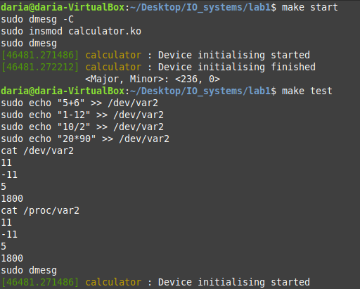

# Лабораторная работа 1

**Название:** "Разработка драйверов символьных устройств"

**Цель работы:** "получить знания и навыки разработки драйверов символьных 
устройств для операционной системы Linux."

## Описание функциональности драйвера

Написать драйвер символьного устройства, удовлетворяющий 
требованиям:
- Драйвер должен создавать символьное устройство /dev/varN, где N –
это номер варианта.
- Драйвер должен создавать интерфейс для получения сведений о 
результатах операций над созданным в п.1.1 символьным 
устройством: файл /proc/varN, где N – номер варианта.
- Должен обрабатывать операции записи и чтения в соответствии с 
вариантом задания (варианты представлены ниже).

### Вариант - 2

При записи в файл символьного устройства текста типа “5+6”
должен запоминаться результат операции, то есть 11 для
данного примера. Должны поддерживаться операции сложения,
вычитания, умножения и деления. Последовательность
полученных результатов с момента загрузки модуля ядра
должна выводиться при чтении созданного файла /proc/varN в
консоль пользователя.

При чтении из файла символьного устройства в кольцевой
буфер ядра должен осуществляться вывод тех же данных,
которые выводятся при чтении файла /proc/varN.

## Инструкция по сборке
### Сборка
```
make
```
### Установка модуля
```
make start
```

### Удаление модуля
```
make exit
```

### Тестовые примеры для модуля
```
make test
```

### Очистка директории
```
$ make clean
```
## Инструкция пользователя
### Запись в символьное устройство
```
echo "5+6" >> /dev/var2
```
### Получение количества пробелов записанных в устройство через  `/proc/var2`
```
cat /proc/var2
cat /dev/var2
```
## Примеры использования


